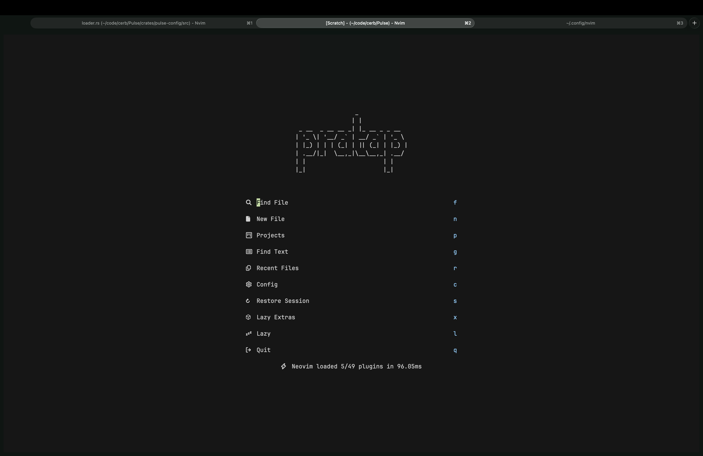
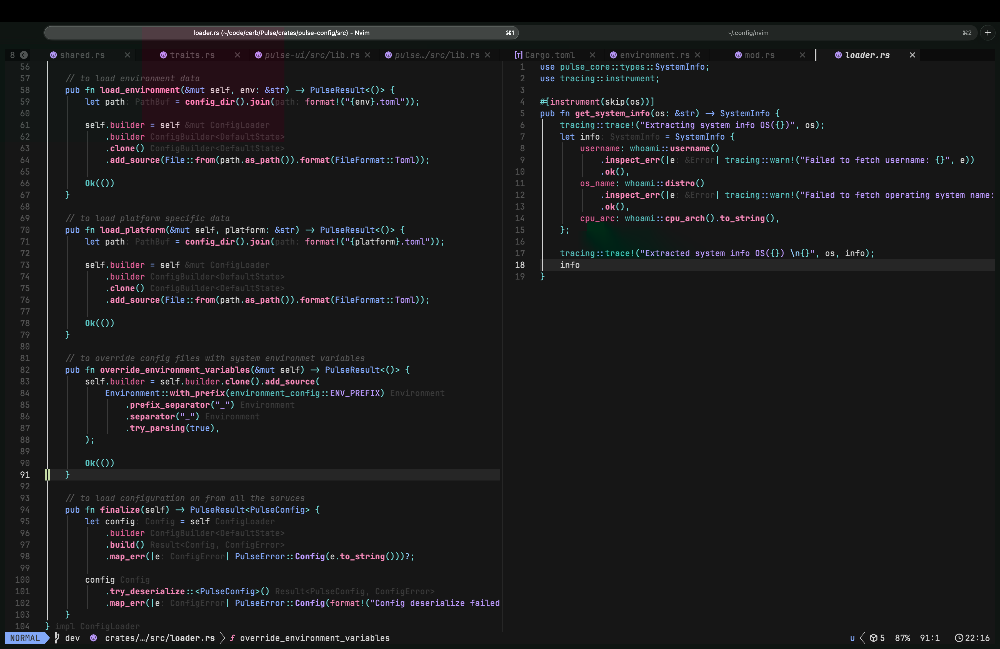

# LazyVim Config

A personalized [LazyVim](https://github.com/LazyVim/LazyVim) distribution for Go, Rust, TypeScript, and C/C++ development — with smooth animations, floating terminals, multiple cursors, and a polished UI.

[](https://neovim.io)
[](https://github.com/LazyVim/LazyVim)
[](LICENSE)

---

## Screenshots




---

## Features

### Language Support

| Language | LSP | Formatter | Debugger |
|----------|-----|-----------|----------|
| Go | gopls | conform.nvim | nvim-dap-go |
| Rust | rust-analyzer / rustaceanvim | conform.nvim | nvim-dap |
| TypeScript / JavaScript | ts_ls | conform.nvim | — |
| C / C++ | clangd | conform.nvim | — |
| Lua | lua_ls (via lupa.ls) | stylua | — |
| JSON / YAML / TOML | schema-store | conform.nvim | — |
| Docker | dockerls | — | — |

### Plugin Highlights

| Category | Plugin | Purpose |
|----------|--------|---------|
| Colorscheme | [oxocarbon.nvim](https://github.com/nyoom-engineering/oxocarbon.nvim) | Default dark theme |
| Colorscheme | [kanagawa.nvim](https://github.com/rebelot/kanagawa.nvim) | Alternative theme |
| Statusline | [lualine.nvim](https://github.com/nvim-lualine/lualine.nvim) | `ayu_dark` theme, clock component |
| Terminal | [toggleterm.nvim](https://github.com/akinsho/toggleterm.nvim) | Floating / horizontal / vertical terminals |
| Cursor | [smear-cursor.nvim](https://github.com/sphamba/smear-cursor.nvim) | Smooth cursor animation |
| Scrolling | [neoscroll.nvim](https://github.com/karb94/neoscroll.nvim) | Smooth scrolling |
| Multi-cursor | [vim-visual-multi](https://github.com/mg979/vim-visual-multi) | Multiple cursors (`<C-n>`) |
| Crates | [crates.nvim](https://github.com/Saecki/crates.nvim) | Rust crate version management |
| Debugging | [nvim-dap](https://github.com/mfussenegger/nvim-dap) + [dap-ui](https://github.com/rcarriga/nvim-dap-ui) | Full DAP support |
| Comments | [ts-comments.nvim](https://github.com/folke/ts-comments.nvim) | Treesitter-based comment toggling |
| UI | [noice.nvim](https://github.com/folke/noice.nvim) | Modern UI notifications and cmdline |
| Navigation | [flash.nvim](https://github.com/folke/flash.nvim) | Jump navigation |
| Search | [grug-far.nvim](https://github.com/MagicDuck/grug-far.nvim) | Search & replace |
| Sessions | [persistence.nvim](https://github.com/folke/persistence.nvim) | Session management |
| Todo | [todo-comments.nvim](https://github.com/folke/todo-comments.nvim) | Highlight TODO/FIXME |
| Which-key | [which-key.nvim](https://github.com/folke/which-key.nvim) | Keymap discovery |
| Completion | [blink.cmp](https://github.com/Saghen/blink.cmp) | Autocompletion |
| Snippets | [friendly-snippets](https://github.com/rafamadriz/friendly-snippets) | Snippet library |

### UI Customizations

- **Dashboard**: Custom ASCII art header via `snacks.nvim`
- **Statusline**: `ayu_dark` theme, powerline-style section separators (``/``), clock display
- **Cursorline**: Enabled for easy line tracking
- **Window title**: Automatically set to current directory name
- **Clipboard**: Syncs with system clipboard (`unnamedplus`)
- **Swap files**: Disabled

---

## Keymaps

### Terminal

| Key | Action |
|-----|--------|
| `<C-\>` | Toggle floating terminal |
| `<leader>tf` | Open floating terminal |
| `<leader>th` | Open horizontal terminal |
| `<leader>tv` | Open vertical terminal |
| `<Esc>` / `jk` | Exit terminal mode |
| `<C-h/j/k/l>` | Navigate windows from terminal |

### Multi-cursor

| Key | Action |
|-----|--------|
| `<C-n>` | Add next occurrence |
| `<C-Down>` | Add cursor below |
| `<C-Up>` | Add cursor above |

### LSP & DAP

> Provided by LazyVim defaults and extras — see [LazyVim keymaps](https://lazyvim.github.io/keymaps).

---

## LSP Configuration

### gopls (`lua/plugins/go.lua`)

```lua
gopls = {
  completeUnimported = true,
  usePlaceholders = true,
  staticcheck = true,
  directoryFilters = { "-.git", "-.vscode", "-.idea", "-.vscode-test", "-node_modules" },
}
```

### rust-analyzer (`lua/plugins/rust.lua`)

```lua
rust_analyzer = {
  cargo = { allFeatures = false },
  checkOnSave = { command = "clippy" },
  procMacro = { enable = false },
}
```

### Big File Handling (`lua/plugins/bigfile.lua`)

Auto-disables Treesitter highlighting for files larger than 100 KB.

---

## Structure

```
~/.config/nvim/
├── init.lua                    # Entry point
├── lazyvim.json                # LazyVim extras config
├── stylua.toml                 # Lua formatting config
├── lua/
│   ├── config/
│   │   ├── lazy.lua            # Plugin specs & lazy.nvim setup
│   │   ├── options.lua         # Editor options
│   │   ├── keymaps.lua         # Custom keymaps (extends LazyVim)
│   │   └── autocmds.lua       # Custom autocommands
│   └── plugins/
│       ├── bigfile.lua         # Big file detection
│       ├── colorscheme.lua     # oxocarbon.nvim
│       ├── crates.lua          # crates.nvim for Rust
│       ├── dashboard.lua       # snacks.nvim dashboard
│       ├── go.lua              # gopls config
│       ├── kang.lua            # kanagawa.nvim theme
│       ├── lualine.vim         # Statusline config
│       ├── multicursor.lua     # vim-visual-multi
│       ├── neoscroll.lua       # Smooth scrolling
│       ├── rust.lua            # rust-analyzer config
│       ├── smear_cursor.lua    # Cursor animation
│       ├── toogleterm.lua      # Floating terminal
│       ├── treesitter.lua      # Treesitter overrides
│       └── ts-comments.lua     # Treesitter comments
```

---

## Getting Started

### Prerequisites

- Neovim >= 0.10.0
- A [Nerd Font](https://www.nerdfonts.com/) (for icons)
- `git`, `make`, `clang`, `go`, `rustup` (for language tooling)

### Installation

```bash
git clone https://github.com/wantedbear007/lazyvim-config.git ~/.config/nvim
nvim --headless "+Lazy! sync" +qa
```

On first launch, `lazy.nvim` bootstraps itself and installs all plugins automatically.

---

## License

[Apache 2.0](LICENSE)
